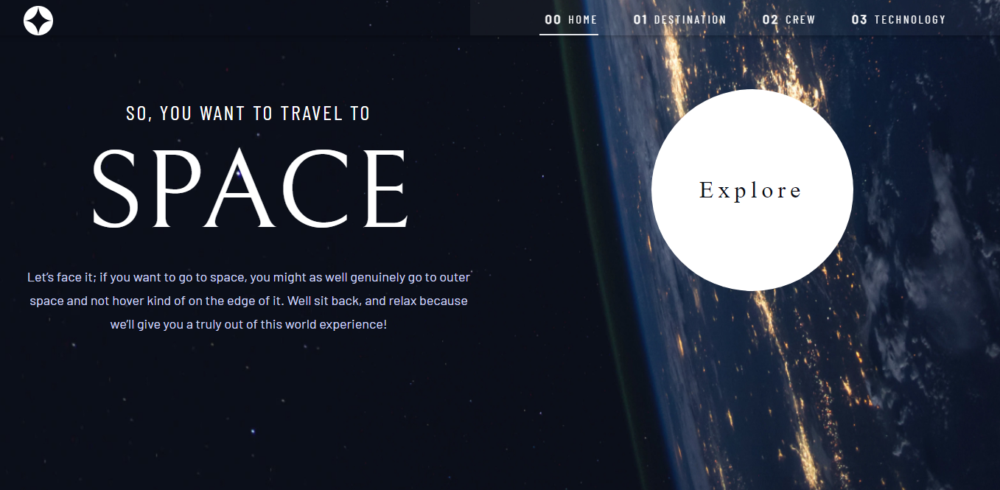

# Frontend Mentor - Space tourism website solution

This is a solution to the [Space tourism website challenge on Frontend Mentor](https://www.frontendmentor.io/challenges/space-tourism-multipage-website-gRWj1URZ3). Frontend Mentor challenges help you improve your coding skills by building realistic projects. 

## Table of contents

- [Overview](#overview)
  - [The challenge](#the-challenge)
  - [Screenshot](#screenshot)
  - [Links](#links)
- [My process](#my-process)
  - [Built with](#built-with)
  - [What I learned](#what-i-learned)
  - [Continued development](#continued-development)
  - [Useful resources](#useful-resources)
- [Author](#author)
- [Acknowledgments](#acknowledgments)


## Overview

### The challenge

Users should be able to:

- View the optimal layout for each of the website's pages depending on their device's screen size
- See hover states for all interactive elements on the page
- View each page and be able to toggle between the tabs to see new information

### Screenshot



### Links

- Solution URL: [Github repo](https://github.com/Geraldoeze/space-info)
- Live Site URL: [Space tourism live site](https://space-info.vercel.app/)

## My process

### Built with

- Semantic HTML5 markup
- CSS custom properties
- Flexbox
- CSS Grid
- TailwindCSS
- Mobile-first workflow
- [React](https://reactjs.org/) - JS library
- [Next.js](https://nextjs.org/) - React framework
- [TailwindCSS](https://tailwindcss.com/) - For styles


### What I learned

In this project, I learned how to use tailwind css in a React application.
How to use it for mobile view and desktop view, styling your HTML elements in-line rather than creating another file for the styles.
Also how to hover states and elements in a site.
And how to view each page and be able to toggle between the tabs to see new information using React and Javascript.

To see how you can add code snippets, see below:

```html
<div className={` flex flex-col justify-center mx-[2rem] my-10  text-center `}>
          <div className={`${pStyles.firstText} md:text-center lg:mb-5 `}>SO, YOU WANT TO TRAVEL TO</div>
          <div className={`${styles.secondText} font-belle`}>SPACE</div>
          <div className={`${styles.lastText} mx-auto`}>
            Let’s face it; if you want to go to space, you might as well
            genuinely go to outer space and not hover kind of on the edge of it.
            Well sit back, and relax because we’ll give you a truly out of this
            world experience!
          </div>
        </div>
```
```css
const styles = {
    mainContent: 'absolute top-[8rem] text-white',
    contentText: "font-poppins text-[16px] leading-[26px] text-[#D0D6F9] lg:text-[18px] lg:leading-[32px]",
    firstText: 'text-[#D0D6F9] font-normal text-[16px] leading-[19px] tracking-[2.7px] md:text-[24px] md:leading-[27.5px] lg:text-[32px] lg:leading-[36.67px]',
    lgContainer: 'flex',
}
```
```js
 const [position, setPosition] = useState(window.pageYOffset)
    const [visible, setVisible] = useState(true) 
    useEffect(()=> {
        const handleScroll = () => {
           let moving = window.pageYOffset
           
           setVisible(position > moving);
           setPosition(moving)
        };
        window.addEventListener("scroll", handleScroll);
        return(() => {
           window.removeEventListener("scroll", handleScroll);
        })
    })
```


### Continued development

There's alot to learn in javascript programming and how it works, I will like to focus more on Typescript and React-redux.
These are some of the third party library that help make javascript development awesome.

### Useful resources

- [Example resource 1](https://www.codeinwp.com/blog/tailwind-css-tutorial/) - This helped me understand tailwind and how it works. I really liked this pattern and will use it going forward.


## Author

- Frontend Mentor - [@Geraldoeze](https://www.frontendmentor.io/profile/Geraldoeze)


